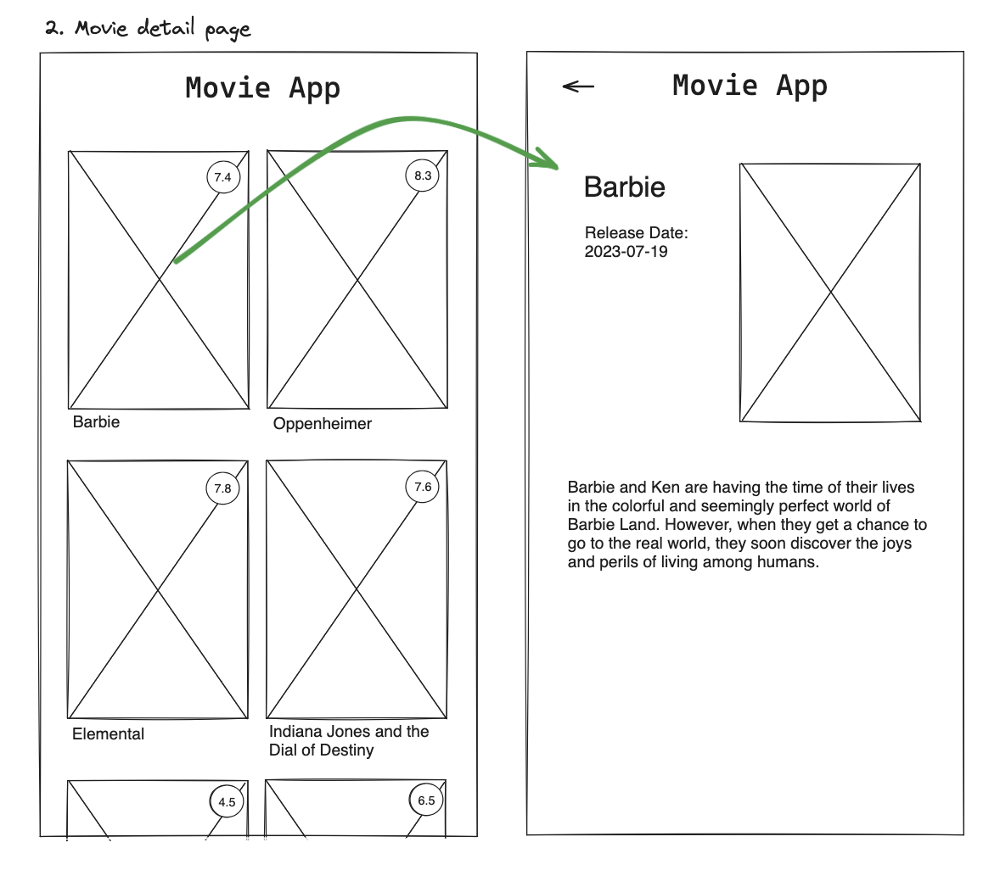

# Title

An app that allows a user to browse through the latest movie releases.

## Value Proposition

**As a** `movie enthusiast anticipating the latest releases`  
**I want to** `quickly be able to browse and compare movies by title and score`  
**so that** `so that I can choose something to watch conveniently`  

## Description

## Acceptance Criteria

Browse homescreen - User sees featured movies, max two movies per row.
Cover preview - User can see a preview of the movie's official poster.
Title preview - User can see and read the official title of the movie below the cover.
Score preview - User can see an average score of the movie 1 (worst) to 10(best)
Empty homescreen - User can see a notification if no movies have been loaded.

-

## Tasks

- Front-End:
  - Build home screen UI
  - Build grid to hold movies
  - Create placeholder for movie poster image
  - Build score UI
  - Create title sectiom
  - Create 'empty page' notification

- Back-End:
- Create endpoint or service for fetching movie listings.
